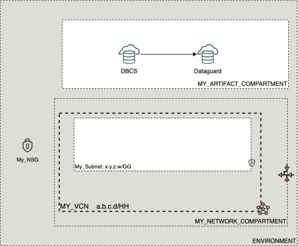

# OCI Cloud Bricks: Sample compute with block storage

[](https://img.shields.io/badge/license-UPL-green) [](https://sonarcloud.io/dashboard?id=oracle-devrel_terraform-oci-cloudbricks-examples)

## Introduction
The following example provisions a Dataguard Database




## Getting Started
For details in how the Oracle CloudBricks Framework works, refer to the [following file](../README.md)

### Prerequisites
- A Pre-Created Object Storage Bucket to store tfstate files
- a Pre-Installed Executor with CLI installed. For instructions in how to install CLI, go to the [following link](https://docs.oracle.com/en-us/iaas/Content/API/SDKDocs/cliinstall.htm)
- A Pre-Configured .oci/config file with API Keys. For details in how to do this step, go to the [following link](https://docs.oracle.com/en-us/iaas/Content/API/Concepts/apisigningkey.htm). File should look similar to this: 
  
```shell

[DEFAULT]
user=ocid1.user.oc1..aaaaaaaafoobarfoobarfoobar
fingerprint=9a:9e:13:cf:94:6e:2c:b9:54:D1:60:0d:e4:14:8b:5e
tenancy=ocid1.tenancy.oc1..aaaaaaaaoqdyfoobarfoobarfoobar
region=re-region-1
key_file=/full/path/to/api/key/my_api_key.pem

```

- A Pre-Configured .aws/credentials file with values from pre-created Customer Secret Keys. File should look similar to this: 
  
```shell
[default]
aws_access_key_id=202ad26f6546c71cc8990c821eece00a6b543ssa21231
aws_secret_access_key=xgYpRAiel5Yxrc9G67MGddaskjdhalsdiujlewiH3NxX4ZMe4=
```

For instructions in how to create Customer Secret Keys, go to the [following link](https://docs.oracle.com/en-us/iaas/Content/Identity/Tasks/managingcredentials.htm#To4)

---

## Components
The following system contains the following components: 

### [backend.tf](./backend.tf)

This file defines the S3 compatibility API integration to store .tfstate file into an OCI Bucket. It's content is the following: 

```go
terraform {
  backend "s3" {
    bucket   = "Precreated_bucket_to_store_tfstate_files_name"
    key      = "Samples/sample_hub_spoke_compartment_with_parent.tfstate"
    region   = "re-region-1"
    endpoint = "https://Tenancy_ObjectStorage_namespace.compat.objectstorage.re-region-1.oraclecloud.com"

    skip_region_validation      = true
    skip_credentials_validation = true
    skip_metadata_api_check     = true
    force_path_style            = true
  }
}
```

*Considerations*

- The `bucket` variable, requires the display name of the bucket where tfstate files will be stored
- The `key` variable, supports a structure of your choice, by providing `/`as separators. Name of the file should always be `system_name.tfstate`
- The `region` variable contains the name id of the region where the system is being deployed at
- The `endpoint` variable contains the concatenation of the tenancy namespace and the region as depicted on above example. For instructions in how to determine the Tenancy Object Storage namespace, refer to the [following documentation](https://docs.oracle.com/en-us/iaas/Content/Object/Tasks/understandingnamespaces.htm)
- The rest of *variables* require to be set as is. **Do not change nor update these values**

---

### [datasource.tf](./datasource.tf)
This file defines the datasources required for internal tracking lookup on Open Source Project. Do not alter this file

---

### [main.tf](./main.tf) 
This file defines the main orchestration of module. The following structure is expected

```go
module "ModuleName" {

  source = "git::ssh://git@github.com/oracle-devrel/module.git?ref=v1.0.0"
  providers = {
    oci.home = oci.home
  }
  ######################################## PROVIDER SPECIFIC VARIABLES ######################################
  tenancy_ocid     = var.tenancy_ocid
  region           = var.region
  user_ocid        = var.user_ocid
  fingerprint      = var.fingerprint
  private_key_path = var.private_key_path
  ######################################## PROVIDER SPECIFIC VARIABLES ######################################
  ######################################## COMPARTMENT SPECIFIC VARIABLES ######################################
  module  = foo
  variables = bar
  here      = bar
  ######################################## COMPARTMENT SPECIFIC VARIABLES ######################################
}
```

*Considerations*
- Whereas needed, apply variable and module overloading
- For module specifics, refer to module documentation: 
  - [terraform-oci-cloudbricks-dbcs-dataguard](https://github.com/oracle-devrel/terraform-oci-cloudbricks-dbcs-dataguard/blob/main/README.md)
- For variable usage, refer to section *Variable Documentation*

---

### [output.tf](./output.tf)
The following file defines the output of system, for future forward integration use with Configuration Management Tools

---


### [README.md](./README.md)
This file

---

### [system.tfvars](./system.tfvars)
The following file defines the specific variables customized using variable overloading. Please refer to backend brick module documentation for details in how to fill.
For module specifics, refer to module documentation: 
  - [terraform-oci-cloudbricks-compartment](https://github.com/oracle-devrel/terraform-oci-cloudbricks-compartment/blob/main/README.md)


---


### [variables.tf](./variables.tf)
The following file defines all the variables used in this system. For details on it's content, refer to section *Variable Documentation*

---
## Variable Documentation## Requirements

| Name | Version |
|------|---------|
| <a name="requirement_terraform"></a> [terraform](#requirement\_terraform) | >= 0.13.5 |
| <a name="requirement_oci"></a> [oci](#requirement\_oci) | >= 4.36.0 |

## Providers

| Name | Version |
|------|---------|
| <a name="provider_oci"></a> [oci](#provider\_oci) | >= 4.36.0 |

## Modules

| Name | Source | Version |
|------|--------|---------|
| <a name="module_dataguard01"></a> [dataguard01](#module\_dataguard01) | git::ssh://git@github.com/oracle-devrel/terraform-oci-cloudbricks-dbcs-dataguard.git | v1.0.0 |

## Resources

| Name | Type |
|------|------|
| [oci_identity_region_subscriptions.home_region_subscriptions](https://registry.terraform.io/providers/hashicorp/oci/latest/docs/data-sources/identity_region_subscriptions) | data source |

## Inputs

| Name | Description | Type | Default | Required |
|------|-------------|------|---------|:--------:|
| <a name="input_dataguard01_creation_type"></a> [dataguard01\_creation\_type](#input\_dataguard01\_creation\_type) | Specifies whether to create the peer database in an existing DB system or in a new DB system. | `string` | `"NewDbSystem"` | no |
| <a name="input_dataguard01_database_admin_password"></a> [dataguard01\_database\_admin\_password](#input\_dataguard01\_database\_admin\_password) | A strong password for the SYS, SYSTEM, and PDB Admin users to apply during standby creation. | `any` | n/a | yes |
| <a name="input_dataguard01_delete_standby_db_home_on_delete"></a> [dataguard01\_delete\_standby\_db\_home\_on\_delete](#input\_dataguard01\_delete\_standby\_db\_home\_on\_delete) | if set to true the destroy operation will destroy the standby dbHome/dbSystem that is referenced in the Data Guard Association. The Data Guard Association gets destroyed when standby dbHome/dbSystem is terminated. Only true is supported at this time. If you change an argument that is used during the delete operation you must run terraform apply first so that that the change in the value is registered in the statefile before running terraform destroy. terraform destroy only looks at what is currently on the statefile and ignores the terraform configuration files. | `bool` | `true` | no |
| <a name="input_dataguard01_dg_availability_domain_number"></a> [dataguard01\_dg\_availability\_domain\_number](#input\_dataguard01\_dg\_availability\_domain\_number) | Describes the Availability domain number where the primary DBCS is located at | `any` | n/a | yes |
| <a name="input_dataguard01_dg_display_name"></a> [dataguard01\_dg\_display\_name](#input\_dataguard01\_dg\_display\_name) | Display name of Dataguard DB Instance | `any` | n/a | yes |
| <a name="input_dataguard01_dg_hostname"></a> [dataguard01\_dg\_hostname](#input\_dataguard01\_dg\_hostname) | The hostname for the DB node. | `any` | n/a | yes |
| <a name="input_dataguard01_dg_instance_compartment_name"></a> [dataguard01\_dg\_instance\_compartment\_name](#input\_dataguard01\_dg\_instance\_compartment\_name) | Defines the compartment name where the infrastructure will be created | `any` | n/a | yes |
| <a name="input_dataguard01_dg_network_compartment_name"></a> [dataguard01\_dg\_network\_compartment\_name](#input\_dataguard01\_dg\_network\_compartment\_name) | Defines the compartment where the Network is currently located | `any` | n/a | yes |
| <a name="input_dataguard01_dg_shape"></a> [dataguard01\_dg\_shape](#input\_dataguard01\_dg\_shape) | he virtual machine DB system shape to launch for the standby database in the Data Guard association. The shape determines the number of CPU cores and the amount of memory available for the DB system. Only virtual machine shapes are valid options. If you do not supply this parameter, the default shape is the shape of the primary DB system. | `any` | n/a | yes |
| <a name="input_dataguard01_network_subnet_name"></a> [dataguard01\_network\_subnet\_name](#input\_dataguard01\_network\_subnet\_name) | Defines the subnet name associated to the artifact | `any` | n/a | yes |
| <a name="input_dataguard01_primary_database_name"></a> [dataguard01\_primary\_database\_name](#input\_dataguard01\_primary\_database\_name) | Name of the primary database to which this dataguard will be attached to | `any` | n/a | yes |
| <a name="input_dataguard01_primary_db_home_display_name"></a> [dataguard01\_primary\_db\_home\_display\_name](#input\_dataguard01\_primary\_db\_home\_display\_name) | Describes the user friendly display name of primary DB | `any` | n/a | yes |
| <a name="input_dataguard01_protection_mode"></a> [dataguard01\_protection\_mode](#input\_dataguard01\_protection\_mode) | The protection mode to set up between the primary and standby databases. For more information, see Oracle Data Guard Protection Modes in the Oracle Data Guard documentation. | `any` | n/a | yes |
| <a name="input_dataguard01_transport_type"></a> [dataguard01\_transport\_type](#input\_dataguard01\_transport\_type) | The redo transport type to use for this Data Guard association. Valid values depend on the specified protectionMode MAXIMUM\_AVAILABILITY - SYNC or FASTSYNC MAXIMUM\_PERFORMANCE - ASYNC MAXIMUM\_PROTECTION - SYNC | `any` | n/a | yes |
| <a name="input_fingerprint"></a> [fingerprint](#input\_fingerprint) | API Key Fingerprint for user\_ocid derived from public API Key imported in OCI User config | `any` | n/a | yes |
| <a name="input_private_key_path"></a> [private\_key\_path](#input\_private\_key\_path) | Private Key Absolute path location where terraform is executed | `any` | n/a | yes |
| <a name="input_region"></a> [region](#input\_region) | Target region where artifacts are going to be created | `any` | n/a | yes |
| <a name="input_tenancy_ocid"></a> [tenancy\_ocid](#input\_tenancy\_ocid) | OCID of tenancy | `any` | n/a | yes |
| <a name="input_user_ocid"></a> [user\_ocid](#input\_user\_ocid) | User OCID in tenancy. Currently hardcoded to user denny.alquinta@oracle.com | `any` | n/a | yes |

## Outputs

| Name | Description |
|------|-------------|
| <a name="output_dataguard"></a> [dataguard](#output\_dataguard) | Dataguard Instance |
---

## Contributing
This project is open source.  Please submit your contributions by forking this repository and submitting a pull request!  Oracle appreciates any contributions that are made by the open source community.

## License
Copyright (c) 2021 Oracle and/or its affiliates.

Licensed under the Universal Permissive License (UPL), Version 1.0.

See [LICENSE](LICENSE) for more details.